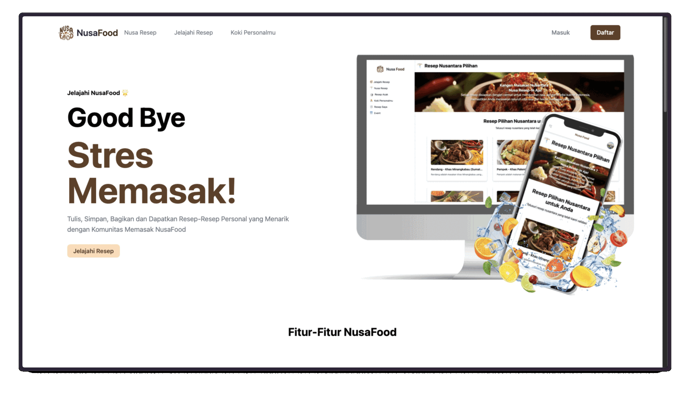

# Nusa Food

Discover culinary creativity with our AI-powered food app! Whether you want to generate recipes based on your available ingredients or get inspired by random suggestions, our app has you covered. Connect with fellow food enthusiasts by posting, liking, sharing, and commenting on recipes. You can even chat with other users to exchange tips, ideas, and food stories. A perfect blend of personalized cooking and community interaction—all in one place!




## Features

-   **Recipe Generation**: Generate recipes based on your available ingredients.
-   **Random Suggestions**: Get inspired by random recipe suggestions.
-   **Community Interaction**: Post, like, share, and comment on recipes.
-   **Chat**: Exchange tips, ideas, and food stories with other users.
-   **Personalized Experience**: Tailored suggestions and interactions based on user preferences.

## Tech Stack

### User Client Side

-   **Tailwind CSS**: For styling the user interface.
-   **Google Auth**: For user authentication.
-   **TypeScript**: For type-safe JavaScript.
-   **Cloudinary**: For image and video management.
-   **TalkJS**: For chat functionality.
-   **BlockNote**: For rich text editing.
-   **Next.js**: For server-side rendering and static site generation.
-   **Framer Motion**: For animations.

-   **Repository**: [User Client Side](https://github.com/Nusa-Foods/web-client)

### Server Side

-   **MongoDB**: For database management.
-   **Node.js**: For server-side JavaScript runtime.
-   **Express**: For building the server API.
-   **Meta LLaMA3-8B-8192 LLM Models**: For AI-powered recipe generation.
-   **Google Auth**: For user authentication.
-   **GROQ**: For querying data.
-   **JWT**: For secure user sessions.
-   **Jest**: For testing.
-   **MailJS**: For email functionalities.

### Admin Client Side

-   **Tailwind CSS**: For styling the admin interface.
-   **React**: For building the admin interface.
-   **Cloudinary**: For image and video management.

-   **Repository**: [Admin Client Side](https://github.com/Nusa-Foods/admin-web-client)

### Prerequisites

-   Node.js
-   MongoDB
-   Google Cloud account for Google Auth and Cloudinary
-   Meta LLaMA3-8B-8192 LLM Models access

-   **Repository**: [Admin Client Side](https://github.com/Nusa-Foods/main-server)

### License

This project is licensed under the MIT License.

### Contact

For any inquiries, please contact us at ainurmoh@gmail.com.

Enjoy cooking and connecting with fellow food enthusiasts! ```
